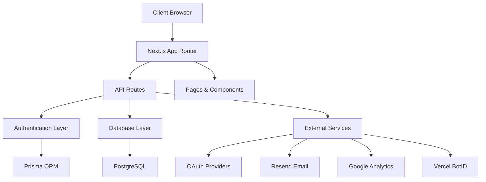
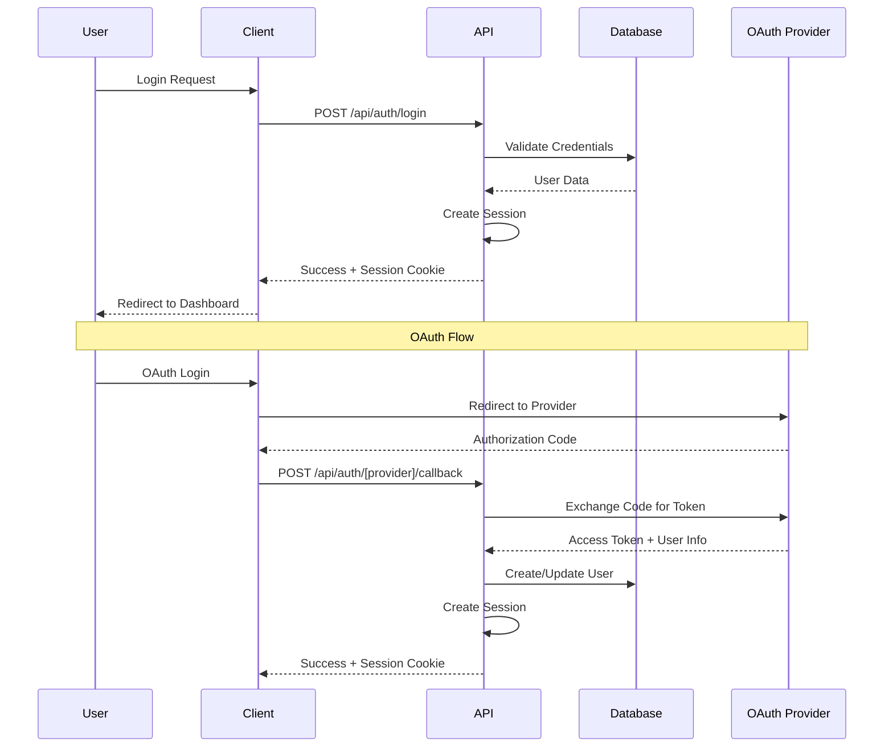
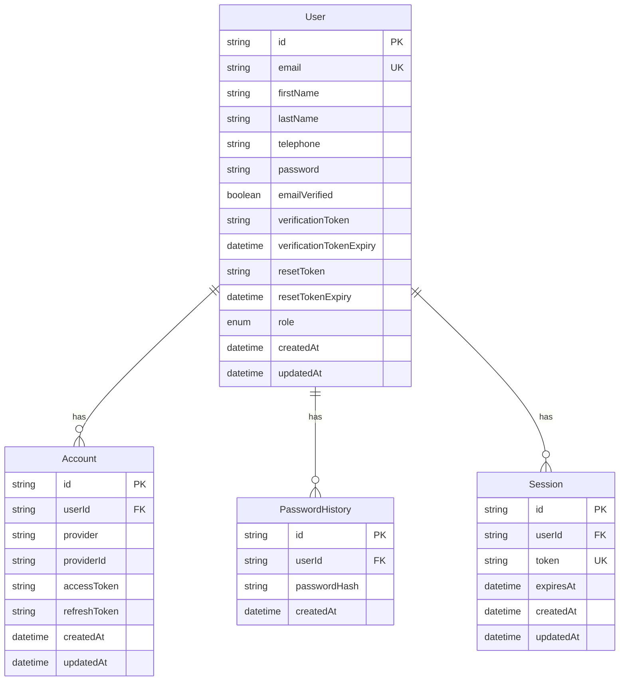

# Architecture Overview

Comprehensive overview of Boiler.click's architecture, design decisions, and technical implementation.

## 🏗️ System Architecture

### High-Level Architecture



### Technology Stack

- **Frontend**: Next.js 16.0.0 with App Router
- **Language**: TypeScript with strict type checking
- **Styling**: Tailwind CSS 4
- **Components**: shadcn/ui component library
- **Database**: PostgreSQL with Prisma ORM
- **Authentication**: Passport.js (planned)
- **Email**: Resend API
- **Analytics**: Google Analytics 4
- **Deployment**: Vercel-optimized

## 📁 Project Structure

### Directory Organization

```
src/
├── app/                    # Next.js App Router
│   ├── (routes)/          # Route groups
│   ├── api/               # API routes
│   └── globals.css        # Global styles
├── components/            # Reusable UI components
│   ├── ui/               # Shadcn/ui components
│   └── [feature].tsx     # Feature-specific components
├── contexts/             # React contexts
├── lib/                  # Utility functions
├── languages/            # i18n translation files
├── types/                # TypeScript type definitions
└── data/                 # Static data files
```

### Design Patterns

#### 1. Component Architecture

- **Functional Components** with hooks
- **Compound Components** for complex UI
- **Render Props** for flexible data sharing
- **Higher-Order Components** for cross-cutting concerns

#### 2. State Management

- **React Context** for global state
- **Local State** with useState/useReducer
- **Server State** with Prisma
- **Form State** with controlled components

#### 3. Data Flow

- **Unidirectional data flow**
- **Props drilling** minimized with context
- **Server-side rendering** for initial data
- **Client-side hydration** for interactivity

## 🔐 Authentication Architecture

### Authentication Flow



### Session Management

- **Secure HTTP-only cookies**
- **JWT tokens** for stateless authentication
- **Session expiry** based on user preference
- **Remember me** functionality
- **CSRF protection**

### OAuth Integration

- **Multiple providers** (Google, GitHub, Discord, Facebook, Twitter)
- **Unified user model** for all auth methods
- **Token management** for OAuth providers
- **Account linking** for multiple providers

## 🗄️ Database Architecture

### Database Design



### Prisma Integration

- **Type-safe database access**
- **Automatic migrations**
- **Connection pooling** with Prisma Accelerate
- **Query optimization**
- **Serverless optimization**

## 🌐 Internationalization Architecture

### i18n Implementation

```typescript
// Language context structure
interface LanguageContextType {
  language: string;
  setLanguage: (lang: string) => void;
  t: (key: string) => string;
  languages: Language[];
}

// Translation file structure
{
  "account": {
    "profile": {
      "firstName": "First Name",
      "lastName": "Last Name"
    }
  }
}
```

### Supported Languages

- **English (en)** - Default
- **Spanish (es)** - Complete translation
- **French (fr)** - Complete translation
- **Arabic (ar)** - Complete translation with RTL support
- **Japanese (jp)** - Complete translation

### Translation Features

- **Nested key support**
- **Fallback to English**
- **Dynamic language switching**
- **RTL support** for Arabic
- **Context-based translations**

## 🎨 UI/UX Architecture

### Design System

- **Consistent color palette**
- **Typography scale**
- **Spacing system**
- **Component variants**
- **Dark/light mode** support

### Component Library

- **shadcn/ui** base components
- **Custom variants** and themes
- **Accessibility-first** design
- **Responsive design** patterns
- **Animation system** with Framer Motion

### Layout System

- **App Router** for routing
- **Layout components** for consistency
- **Nested layouts** for complex pages
- **Error boundaries** for error handling
- **Loading states** for better UX

## ⚡ Performance Architecture

### Optimization Strategies

#### 1. Bundle Optimization

- **Code splitting** with dynamic imports
- **Tree shaking** for unused code
- **Bundle analysis** tools
- **Turbopack** for faster builds
- **Webpack optimization**

#### 2. Runtime Performance

- **React.memo** for component optimization
- **useMemo/useCallback** for expensive operations
- **Lazy loading** for non-critical components
- **Image optimization** with Next.js
- **Critical CSS** inlining

#### 3. Caching Strategy

- **Static generation** for content pages
- **Server-side rendering** for dynamic content
- **Client-side caching** with React Query
- **CDN caching** with Vercel
- **Database query caching** with Prisma Accelerate

### Performance Monitoring

- **Web Vitals** tracking
- **Custom performance** metrics
- **Error tracking** and reporting
- **Resource loading** monitoring
- **Real user monitoring**

## 🔒 Security Architecture

### Security Layers

#### 1. Application Security

- **Input validation** with Zod
- **SQL injection** prevention with Prisma
- **XSS protection** with React
- **CSRF protection** with tokens
- **Rate limiting** for API endpoints

#### 2. Authentication Security

- **Secure password** hashing
- **JWT token** security
- **Session management** best practices
- **OAuth security** implementation
- **Multi-factor authentication** ready

#### 3. Infrastructure Security

- **HTTPS enforcement**
- **Security headers** configuration
- **Bot protection** with Vercel BotID
- **Environment variable** security
- **Database connection** security

### Security Headers

```typescript
// Security headers configuration
const securityHeaders = [
  {
    key: "X-DNS-Prefetch-Control",
    value: "on",
  },
  {
    key: "Strict-Transport-Security",
    value: "max-age=63072000; includeSubDomains; preload",
  },
  {
    key: "X-XSS-Protection",
    value: "1; mode=block",
  },
  {
    key: "X-Frame-Options",
    value: "SAMEORIGIN",
  },
  {
    key: "X-Content-Type-Options",
    value: "nosniff",
  },
  {
    key: "Referrer-Policy",
    value: "origin-when-cross-origin",
  },
];
```

## 📊 Analytics Architecture

### Analytics Implementation

- **Google Analytics 4** integration
- **Custom event** tracking
- **Performance monitoring**
- **Error tracking**
- **User behavior** analytics

### Data Collection

- **Privacy-compliant** data collection
- **Cookie consent** management
- **GDPR compliance**
- **Data anonymization**
- **Opt-out mechanisms**

## 🚀 Deployment Architecture

### Vercel Optimization

- **Edge functions** for API routes
- **Static generation** for content
- **CDN distribution** worldwide
- **Automatic scaling**
- **Zero configuration** deployment

### Environment Management

- **Environment-specific** configurations
- **Secrets management**
- **Database connection** pooling
- **Feature flags** support
- **A/B testing** ready

## 🔄 Development Workflow

### Git Workflow

- **Feature branches** for development
- **Staging environment** for testing
- **Main branch** for production
- **Automated testing** pipeline
- **Code review** process

### CI/CD Pipeline

- **Automated testing**
- **Code quality** checks
- **Security scanning**
- **Performance testing**
- **Automated deployment**

## 📈 Scalability Considerations

### Horizontal Scaling

- **Stateless** application design
- **Database connection** pooling
- **CDN distribution**
- **Load balancing** ready
- **Microservices** migration path

### Vertical Scaling

- **Optimized queries** with Prisma
- **Efficient caching** strategies
- **Resource optimization**
- **Performance monitoring**
- **Capacity planning**

## 🔮 Future Architecture

### Planned Enhancements

- **Microservices** architecture
- **GraphQL** API layer
- **Real-time** features with WebSockets
- **Advanced caching** with Redis
- **Event-driven** architecture

### Technology Roadmap

- **Next.js** updates and features
- **React** concurrent features
- **TypeScript** improvements
- **Database** optimizations
- **Performance** enhancements

## 📚 Related Documentation

- **[Setup Guide](SETUP.md)** - Installation and configuration
- **[Development Guide](DEVELOPMENT.md)** - Development workflow
- **[API Documentation](API.md)** - API endpoints and usage
- **[Deployment Guide](DEPLOYMENT.md)** - Production deployment
